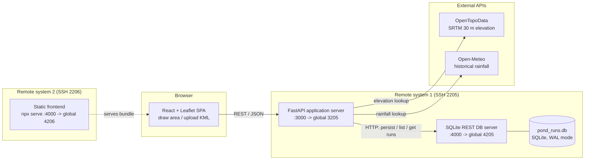
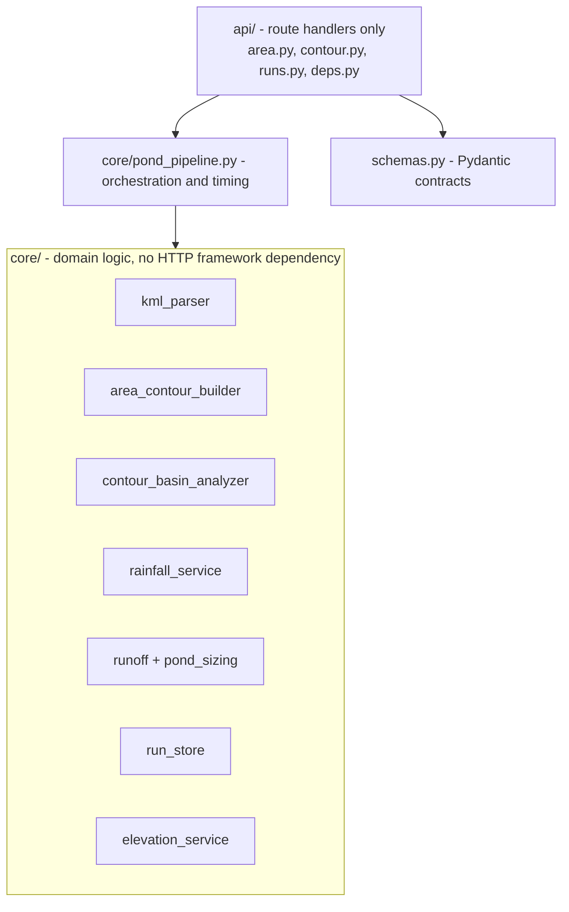
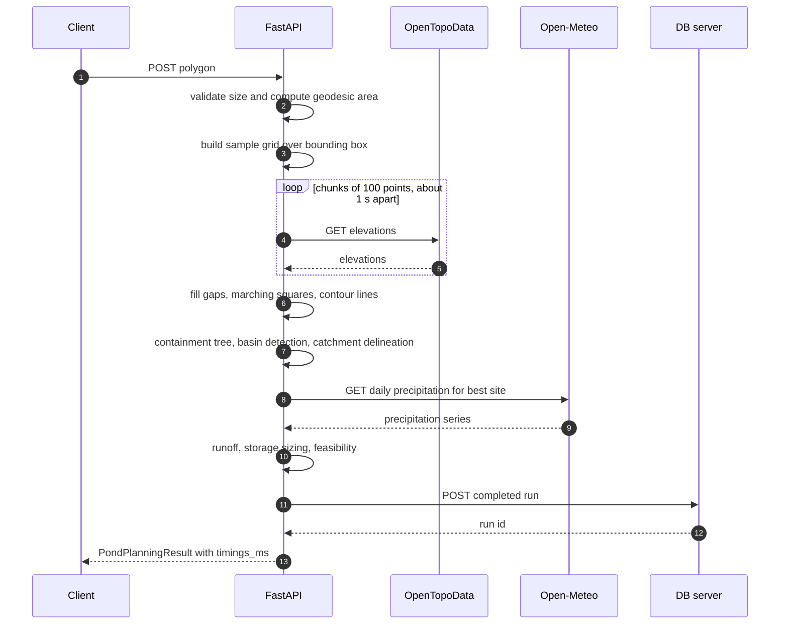

# AI-Based Village Pond Planning System

> A geospatial decision-support platform that recommends where to build a rainwater-harvesting pond, how much land drains into it, and how much water it can hold.

[](https://github.com/ashutosh229/AI_Based_Pond_Planning_System/actions/workflows/backend-ci.yml)
[](https://github.com/ashutosh229/AI_Based_Pond_Planning_System/actions/workflows/frontend-ci.yml)
[](https://github.com/ashutosh229/AI_Based_Pond_Planning_System/actions/workflows/docker-build.yml)


**Repository:** https://github.com/ashutosh229/AI_Based_Pond_Planning_System
**Author:** Ashutosh Kumar Jha
**License:** MIT

---

## Table of Contents

1. [Overview](#1-overview)
2. [Key Capabilities](#2-key-capabilities)
3. [System Architecture](#3-system-architecture)
4. [Request Lifecycle](#4-request-lifecycle)
5. [Core Algorithms](#5-core-algorithms)
6. [Data Model and Persistence](#6-data-model-and-persistence)
7. [API Reference](#7-api-reference)
8. [Design Decisions and Trade-offs](#8-design-decisions-and-trade-offs)
9. [Reliability and Failure Modes](#9-reliability-and-failure-modes)
10. [Performance](#10-performance)
11. [Deployment Topology](#11-deployment-topology)
12. [Getting Started](#12-getting-started)
13. [Configuration](#13-configuration)
14. [Containerization](#14-containerization)
15. [CI/CD Pipeline](#15-cicd-pipeline)
16. [Operations Runbook](#16-operations-runbook)
17. [Testing Strategy](#17-testing-strategy)
18. [Security Posture](#18-security-posture)
19. [Known Limitations](#19-known-limitations)
20. [Scaling Path and Roadmap](#20-scaling-path-and-roadmap)
21. [Repository Layout](#21-repository-layout)
22. [License](#22-license)

---

## 1. Overview

Villages in hilly terrain rely on small farm ponds and check-dams to capture monsoon runoff. A good site needs two things at once:

1. a **natural depression** that can hold water, and
2. a **large enough upstream catchment** to fill it.

Judging both from a contour map or a walk of the land is slow and error-prone. Rainfall data is rarely available at village level, and turning "this basin drains this much land" into "the pond should be this deep and hold this much water" needs a runoff calculation most people won't do by hand.

This system takes either **a polygon drawn on a map** or **a KML/KMZ contour file** and returns, in a single request:

| Output | Description |
|---|---|
| **Suggested pond location** | The best-ranked natural depression, plus up to five runner-ups |
| **Catchment area** | Boundary polygon (GeoJSON) and geodesic area on the WGS84 ellipsoid |
| **Expected water volume** | Annual runoff, design storage, usable volume, recommended depth and a feasibility verdict, derived from historical rainfall at the site |

Every completed analysis is persisted, so past results can be reloaded without re-running the pipeline.

---

## 2. Key Capabilities

- **Two interchangeable input modes.** A freeform polygon on an interactive map (elevation sampled live from SRTM), or a KML/KMZ contour export. Both converge on one pipeline.
- **Topology-based basin detection.** Works directly on vector contour lines, using a spatial-indexed containment tree and drainage-divide (saddle) detection.
- **Automated hydrology chain.** Historical rainfall lookup, then runoff, storage sizing, depth and feasibility.
- **Run history.** Each result is saved to a dedicated database service and can be reloaded from the UI.
- **Observability by construction.** Every response carries a `timings_ms` breakdown of each pipeline stage.
- **Graceful degradation.** Rainfall and persistence failures never prevent the primary result from being returned.
- **Delivery tooling.** Docker images for local reproducibility and a five-workflow GitHub Actions pipeline.

---

## 3. System Architecture

The system has three independently deployable services and two external read-only data providers.



### Layering inside the application server



The layering is strict: `api/` contains only route handlers, all logic lives in `core/`, and contracts live in `schemas.py`. The domain logic is therefore unit-testable without FastAPI or a network. All three outbound clients (`ElevationService`, `RainfallService`, `RunStore`) accept an injectable `httpx` transport, wired in through FastAPI's `Depends`.

### Why the database is a separate service

The application server does not open the SQLite file. It talks to a small REST service (`db_server.py`) over HTTP. This has three consequences:

- **The app server stays stateless.** It holds no local files, so replicas can be added without shared-disk concerns.
- **The persistence backend is swappable.** Nothing in the pipeline assumes SQLite. It depends only on `save_run`, `list_runs` and `get_run`.
- **Failure domains are separated.** The database can be restarted or rebuilt independently of the API.

---

## 4. Request Lifecycle

### Drawn-area flow (`POST /api/analyzeArea`)



### KML flow (`POST /api/recommendPond`)

Identical from the "containment tree" step onward. The elevation-sampling steps are replaced by KML/KMZ parsing (`kml_parse_ms`). Because both routes call the same `run_pond_pipeline()`, they behave identically from that point, including persistence.

---

## 5. Core Algorithms

### 5.1 Contour source normalization

Both input paths produce the same structure: `ContourLine(elevation, points[(lon, lat)], is_closed)`.

**KML/KMZ.** `kml_parser.py` walks the document for `Placemark → LineString → elevation`, without depending on folder names. Elevation is read from `<name>` first, then from `ExtendedData` fields (`elevation`, `elev`, `height`, `contour`, `value`, `z`). Rings are flagged closed or open, and `.kmz` archives are unwrapped.

**Drawn polygon.** `area_contour_builder.py`:

1. Builds a regular lat/lon grid over the polygon's bounding box, padded by 5%.
2. Chooses grid density from **target ground spacing** (30 m, matching SRTM resolution), clamped to `[9, 80]` per side and to a hard cap on total points (default 1,024). Resolution scales with area, and cost is bounded.
3. Fetches elevations in chunks of 100 with a 1 s inter-request delay, to respect the public OpenTopoData limits.
4. Fills missing samples (usually water) by nearest-neighbour interpolation (`scipy.interpolate.griddata`).
5. Picks a contour interval from the sampled range, snapped to a "nice" step (0.5, 1, 2, 2.5, 5, 10, ...). Terrain with less than 0.5 m of relief is rejected with HTTP 422.
6. Extracts contours with **marching squares** (`skimage.measure.find_contours`). Paths touching the grid edge are marked open, the same semantics as a KML contour clipped by its map boundary.

### 5.2 Basin detection and catchment delineation

Because the input is vector contour lines, the algorithm works on **contour topology** rather than approximating a raster for D8 flow accumulation.

1. **Keep closed rings only.** Containment cannot be tested for open rings.
2. **Build a containment tree.** Each ring's parent is the smallest-area ring, at any elevation, that fully contains it. A Shapely `STRtree` spatial index prunes candidates, avoiding brute-force O(n²) checks.
3. **Classify leaves.** A leaf ring (nothing nested inside) whose parent is at a **higher** elevation is a basin. A lower parent means a hilltop, which is discarded.
4. **Walk outward from each pit** while elevation increases. Stop at the first ring that contains more than one nested basin. That ring is a **drainage divide (saddle)**. The last valid ring before it is the catchment boundary.
5. **Filter and rank.** Basins shallower than `min_basin_depth_m` (default 2 m, overridable per request) are dropped as noise. The rest are ranked by catchment area. Rank 1 is the recommendation, and up to five alternatives are returned.

Areas are computed with `pyproj.Geod.polygon_area_perimeter` on WGS84 lon/lat. This avoids both degree-space distortion and guessing a UTM zone.

### 5.3 Rainfall, runoff and pond sizing

```
annual_rainfall_m     = sum(daily precipitation over last N complete years) / N
annual_runoff_m3      = runoff_coefficient x catchment_area_m2 x annual_rainfall_m
design_storage_m3     = annual_runoff_m3 x capture_fraction
usable_volume_m3      = design_storage_m3 x (1 - loss_factor)
recommended_depth_m   = usable_volume_m3 / pond_footprint_area_m2
feasible              = 0.5 m <= recommended_depth_m <= 4.0 m   (deeper is infeasible, shallower is flagged)
```

Defaults: `runoff_coefficient = 0.3`, `capture_fraction = 0.2`, `loss_factor = 0.15`, `N = 10` years. `RunoffCalculator` also exposes a rational-method peak-flow helper.

---

## 6. Data Model and Persistence

The database service (`backend/app/db_server.py`) stores one row per completed analysis.

### `runs` table

| Column | Type | Notes |
|---|---|---|
| `id` | `TEXT PRIMARY KEY` | UUIDv4, generated server-side |
| `mode` | `TEXT NOT NULL` | `"area"` or `"kml"` |
| `source` | `TEXT NOT NULL` | Filename or drawn-area description |
| `created_at` | `INTEGER NOT NULL` | Unix seconds |
| `contour_interval_m` | `REAL` | |
| `elevation_min_m`, `elevation_max_m` | `REAL` | |
| `candidate_basins_found` | `INTEGER` | |
| `recommended_catchment_area_m2` | `REAL` | `NULL` when no basin was found |
| `is_feasible` | `INTEGER` | `0`, `1` or `NULL` |
| `result_json` | `TEXT NOT NULL` | Full `PondPlanningResult`, so a run reloads exactly as produced |

**Indexes** match the two access patterns of the history endpoint: `(created_at DESC)` for newest-first and `(mode, created_at DESC)` for newest-first filtered by mode.

**Concurrency model.** SQLite runs in **WAL mode** (`synchronous=NORMAL`). Any number of readers proceed while one writer is active, so a process-wide lock guards only `INSERT`. List and get queries are unlocked, and a burst of history reads never queues behind an analysis save.

**Summary columns vs. JSON blob.** Fields needed by the list view are denormalized into columns, so listing never deserializes large GeoJSON payloads. The blob is read only when a single run is reloaded.

---

## 7. API Reference

Deployed application server: `http://10.1.75.79:3205`. Interactive OpenAPI docs are at `/docs`.

### Application server

| Method | Path | Purpose |
|---|---|---|
| `GET` | `/health` | Liveness probe |
| `POST` | `/api/analyzeArea` | Drawn polygon in, full recommendation out, persisted |
| `POST` | `/api/recommendPond` | KML/KMZ in, full recommendation out, persisted |
| `POST` | `/api/analyzeContour` | KML/KMZ in, basin and catchment analysis only. No rainfall, no persistence, no external calls |
| `POST` | `/api/findCatchment` | Alias of `analyzeContour` (hidden from OpenAPI) |
| `GET` | `/api/runs?limit=&mode=` | List persisted runs, newest first |
| `GET` | `/api/runs/{id}` | One run with its full stored result |

### `POST /api/analyzeArea`

```json
{
  "polygon": [[81.302, 21.255], [81.306, 21.255], [81.306, 21.259], [81.302, 21.259]],
  "min_basin_depth_m": 2.0
}
```

- `polygon`: `[[lon, lat], ...]`, at least 3 vertices, and it need not be explicitly closed.
- `min_basin_depth_m`: optional per-request override of the server default.

**Response `200`: `PondPlanningResult`**

```json
{
  "source": "drawn area (~1.15 km², 256 elevation samples, ~33 m spacing)",
  "contour_interval_m": 25.0,
  "elevation_range_m": [276.6, 551.6],
  "total_contours_parsed": 27,
  "closed_contours_used": 7,
  "candidate_basins_found": 1,
  "recommended_site": {
    "rank": 1,
    "site": { "lat": 21.2568, "lon": 81.3025 },
    "pit_elevation_m": 280.0,
    "catchment_boundary_elevation_m": 288.0,
    "basin_depth_m": 8.0,
    "pond_footprint_area_m2": 1292.7,
    "catchment_area_m2": 27648.1,
    "catchment_boundary_geojson": { "type": "Polygon", "coordinates": [[]] }
  },
  "alternative_sites": [],
  "pond_recommendation": {
    "annual_rainfall_m": 1.1,
    "rainfall_years_used": 10,
    "rainfall_source": "Open-Meteo historical archive",
    "annual_runoff_volume_m3": 348529.53,
    "design_storage_volume_m3": 69705.91,
    "usable_volume_m3": 59250.02,
    "recommended_depth_m": 0.38,
    "is_feasible": true,
    "notes": "Within practical depth range."
  },
  "notes": "...",
  "timings_ms": {
    "elevation_fetch_ms": 812.4,
    "contour_extraction_ms": 41.2,
    "basin_analysis_ms": 6.8,
    "rainfall_lookup_ms": 340.1,
    "pond_sizing_ms": 0.1,
    "db_save_ms": 12.3
  }
}
```

`pond_recommendation` is `null` when no basin passed the depth filter or when the rainfall lookup failed. `notes` explains which.

### `POST /api/recommendPond`

`multipart/form-data` with a `file` field (`.kml` or `.kmz`, max 25 MB). The response has the same shape as above. `source` is the filename, and `timings_ms` contains `kml_parse_ms` instead of the elevation and contour stages.

```bash
curl -X POST "http://10.1.75.79:3205/api/recommendPond" \
  -F "file=@data/sample_contours/contours_1m.kml"
```

### Error contract

| Status | Condition |
|---|---|
| `400` | Wrong file extension, fewer than 3 polygon points, or drawn area outside `[area_min_size_m2, area_max_size_km2]` |
| `404` | Run id not found (`/api/runs/{id}`) |
| `413` | Upload exceeds 25 MB |
| `422` | KML has no usable contours, or sampled terrain is too flat (< 0.5 m relief) |
| `502` | Elevation provider unreachable or returned unusable data |

### Database service (internal)

Deployed at `http://10.1.75.79:4205`. It is called by the application server, not by browsers.

| Method | Path | Purpose |
|---|---|---|
| `POST` | `/runs` | Insert a run, returns `{ok, id, created_at}` with `201` |
| `GET` | `/runs?limit=&mode=` | Summary rows, newest first |
| `GET` | `/runs/{run_id}` | Full row with deserialized `result` |
| `GET` | `/health` | Liveness probe, includes DB file path |

---

## 8. Design Decisions and Trade-offs

| Decision | Rationale | Trade-off accepted |
|---|---|---|
| **Contour topology, not raster D8** | Inputs are vector contours. Building a raster from them is lossy and slow, and the same logic serves both input modes. | Only fully closed depressions are detected (see [Known Limitations](#19-known-limitations)). |
| **One shared pipeline for both inputs** | Zero duplicated logic. Features such as persistence apply to both routes automatically. | The pipeline signature is the integration seam for all future stages. |
| **Spatial-indexed containment tree** | `STRtree` prunes candidates instead of O(n²) checks over up to about 1,300 rings. | Adds a Shapely dependency and index-build cost on small inputs. |
| **Spacing-driven grid with a hard point cap** | Resolution follows area size while elevation-API cost stays bounded. | Very large areas are sampled coarser than the 30 m target. Coarser sampling can miss small basins. |
| **Async I/O everywhere** (`httpx.AsyncClient`) | The event loop stays free while waiting on slow upstreams, which dominate latency. | Async-only code paths need `pytest.mark.anyio` in tests. |
| **Separate DB service over HTTP** | Stateless app tier, swappable storage, isolated failure domain. | One extra network hop per save (measured as negligible). |
| **SQLite + WAL** | Zero-ops, single-file, unlimited concurrent readers, and enough for a single writer at this write rate. | Single-node, single-writer. No built-in replication. |
| **Non-fatal persistence and rainfall** | The user's answer matters more than its history entry or its sizing add-on. | Data can be silently missing from history when the DB is down. The response `notes` flag it. |
| **Dependency injection for all outbound clients** | Tests substitute `httpx.MockTransport` at each boundary, so no live network is needed. | Slight indirection via `deps.py`. |
| **Per-stage `timings_ms` in every response** | Real, reproducible performance data without separate benchmark tooling. | Small payload overhead. |
| **Docker for local use only** | The lab hosts provide no container runtime. | Local images are not the production artifact (see [Containerization](#14-containerization)). |

---

## 9. Reliability and Failure Modes

| Dependency | Failure | Behaviour |
|---|---|---|
| OpenTopoData | Unreachable, HTTP error or bad JSON | `ElevationLookupError`, then HTTP **502**. Analysis cannot proceed without terrain. |
| OpenTopoData | Some points have no DEM coverage | Filled by nearest-neighbour interpolation. If **all** are missing, HTTP 502. |
| Terrain | Under 0.5 m of relief | `TerrainTooFlatError`, then HTTP **422** with guidance. |
| Open-Meteo | Unreachable or no data | **Non-fatal.** Basin and catchment returned, `pond_recommendation = null`, and the reason is appended to `notes`. |
| DB server | Unreachable on save | **Non-fatal.** `save_run` returns `None` after a 5 s timeout, a note is appended, and the full result is still returned. |
| DB server | Unreachable on history read | `GET /api/runs*` return an error. The UI shows it inline, and the analysis flow is unaffected. |
| Analysis result | No basin found | Valid result: zero candidates, a suggestion in `notes`, and the run is still persisted. |

**Worst-case latency added by a dead database:** `db_save_timeout_s` (5 s) on each analysis.

---

## 10. Performance

Measured from real `timings_ms` responses.

**Drawn-area run.** About 21.68 km² of real hilly terrain. The 1,024-point cap gave about 252 m spacing, against a 30 m target.

| Stage | Time |
|---|---|
| Elevation fetch | 14,980 ms |
| Contour extraction | 61 ms |
| Basin analysis | 2.9 ms |
| **Total** | **about 15.0 s** |

Elevation lookup dominates by nearly two orders of magnitude. 1,024 points need about 11 sequential, rate-limited chunks (about 1 s each), which accounts for roughly 10–11 s of the observed 15 s. Computation is negligible by comparison.

**KML run** (`contours_1m.kml`: 1,355 contours, 1,127 closed rings, 56 basins). Parsing plus basin analysis stays well under a second, with no external calls.

**Optimization levers**, in order of expected payoff:

1. Cache elevation tiles and per-coordinate rainfall. Rainfall changes at most yearly.
2. Self-host an OpenTopoData instance to remove the rate limit.
3. Raise the point cap or chunk concurrency only if the elevation source allows it.

---

## 11. Deployment Topology

Services run on two lab-provided remote systems. Each is a Linux container reached over SSH, with no Docker access, no `systemd` and no root.

**Port-mapping convention**

```
global_port = local_port + (SSH_port - 2000)
```

| Service | Host | Local port | Global URL |
|---|---|---|---|
| FastAPI application server | System 1 (SSH 2205) | 3000 | `http://10.1.75.79:3205` |
| SQLite REST DB server | System 1 (SSH 2205) | 4000 | `http://10.1.75.79:4205` |
| Static frontend (`npx serve`) | System 2 (SSH 2206) | 4000 | `http://10.1.75.79:4206` |

Processes are managed with `nohup` and **PID files** under `backend/.pids/` and `frontend/.pids/`, driven by idempotent scripts in `scripts/`. Only ports 3000–8000 in steps of 1000 are allowed inside the systems.

---

## 12. Getting Started

### Prerequisites

- Python 3.10+ (CI and Docker use 3.12)
- Node.js 18+ (CI and Docker use 20)
- Optional: Docker and Docker Compose, for the containerized stack

### Run locally (three terminals)

**1. Database service**

```bash
cd backend
python -m venv venv && source venv/bin/activate   # Windows: venv\Scripts\activate
pip install -r requirements.txt
SQLITE_DB_PATH=pond_runs.db DB_SERVER_PORT=4000 python app/db_server.py
```

**2. Application server**

```bash
cd backend
source venv/bin/activate
DB_SERVER_BASE_URL=http://localhost:4000 \
  uvicorn app.main:app --reload --port 3000
# Swagger UI: http://localhost:3000/docs
```

**3. Frontend**

```bash
cd frontend
npm install
echo "VITE_API_BASE_URL=http://localhost:3000" > .env
npm run dev
# http://localhost:5173
```

### Smoke test

```bash
curl http://localhost:3000/health
curl http://localhost:4000/health
curl -X POST http://localhost:3000/api/recommendPond \
     -F "file=@data/sample_contours/contours_1m.kml"
curl http://localhost:3000/api/runs
```

> The database service defaults to port `5000` when `DB_SERVER_PORT` is unset. The deployed and Compose setups both set it to `4000` explicitly.

---

## 13. Configuration

All backend settings live in `backend/app/config.py` (`pydantic-settings`). Override any of them through environment variables (case-insensitive) or `backend/.env`.

| Setting | Default | Purpose |
|---|---|---|
| `db_server_base_url` | `http://10.1.75.79:4205` | Base URL of the DB service. Inside Docker Compose it is `http://db-server:4000`. |
| `db_save_timeout_s` | `5.0` | Timeout for persistence calls |
| `open_meteo_base_url` | `https://archive-api.open-meteo.com/v1/archive` | Rainfall source |
| `elevation_api_base_url` | `https://api.opentopodata.org/v1/srtm30m` | Elevation source |
| `rainfall_years` | `10` | Years of history averaged |
| `default_runoff_coefficient` | `0.3` | Runoff model input |
| `default_capture_fraction` | `0.2` | Runoff model input |
| `default_loss_factor` | `0.15` | Pond sizing input |
| `min_basin_depth_m` | `2.0` | Minimum depth for a basin to count as real, not noise |
| `area_target_spacing_m` | `30.0` | Target ground spacing between elevation samples |
| `area_grid_min_side` / `area_grid_max_side` | `9` / `80` | Grid side clamp |
| `area_max_grid_points` | `1024` | Hard ceiling on samples per request (bounds latency and API cost) |
| `area_contour_levels` | `15` | Target number of contour levels |
| `area_min_size_m2` / `area_max_size_km2` | `500` / `500` | Sanity bounds on drawn area |
| `elevation_chunk_size` | `100` | Points per OpenTopoData request |
| `elevation_request_delay_s` | `1.0` | Delay between elevation chunks |

**DB service environment:** `SQLITE_DB_PATH` (default `pond_runs.db`) and `DB_SERVER_PORT` (default `5000`).
**Frontend build-time:** `VITE_API_BASE_URL`, inlined into the bundle by Vite. Changing it requires a rebuild.

---

## 14. Containerization

Docker is used for **local development and reproducibility**. The lab hosts have no container runtime, so the running deployment uses the bare-metal path in [Deployment Topology](#11-deployment-topology).

| Artifact | Details |
|---|---|
| `backend/Dockerfile` | Multi-stage. A `python:3.12-slim` builder installs dependencies into a venv, and a slim **non-root** runtime copies only the venv and app code. Includes a `HEALTHCHECK`. |
| Backend and DB service | **One image, two commands.** The default command runs uvicorn, and Compose overrides it with `python app/db_server.py` for the DB service. |
| `frontend/Dockerfile` | `node:20-alpine` builds the Vite bundle. `nginx-unprivileged` serves it on 8080 with an SPA fallback and a `/health` route. |
| `docker-compose.yml` | Three services on a private bridge network (`pond-net`), CPU and memory limits, rotated JSON logs, health-gated startup (`depends_on: service_healthy`), and a named volume `db-data` for the SQLite file. |

Inside Compose, the backend reaches the DB service at `http://db-server:4000` over the internal network, never through a host port.

**Run the stack**

```bash
# .env at the repository root
cat > .env <<'EOF'
LOCAL_BACKEND_PORT=3000
LOCAL_DB_PORT=4000
LOCAL_FRONTEND_PORT=5000
EOF

docker compose up -d --build
docker compose ps
curl http://localhost:3000/health   # backend
curl http://localhost:4000/health   # db-server
curl http://localhost:5000/         # frontend
```

Stop without losing data with `docker compose down`. Never use `-v`, which deletes the `db-data` volume.

> The containerized frontend uses **nginx**, while the remote deployment uses **`npx serve`**. Both serve the same Vite build output. `serve` needs no extra install on a Docker-less host.

---

## 15. CI/CD Pipeline

| Workflow | Trigger | Action |
|---|---|---|
| `backend-ci.yml` | PR or push touching `backend/**` | Install dependencies, run `pytest` |
| `frontend-ci.yml` | PR or push touching `frontend/**` | `npm ci`, `npm run build` |
| `docker-build.yml` | PR or push touching `backend/**` or `docker-compose.yml` | Build the backend image (build-only, never pushed) |
| `deploy-backend.yml` | Push to `main` or manual dispatch | Re-run tests as a deploy gate, SSH to system 1, run `scripts/remote_deploy.sh` |
| `deploy-frontend.yml` | Push to `main` or manual dispatch | Re-run the build as a gate, SSH to system 2, run `scripts/remote_deploy_frontend.sh` |

**Deploy scripts** (idempotent, PID-file based):

1. `git fetch` and `git reset --hard origin/main`, so the remote mirrors `main` exactly. Do not hand-edit files on the remote.
2. Reinstall dependencies (`pip install` or `npm ci`) and rebuild the bundle for the frontend.
3. Stop the previous process from its PID file (SIGTERM, then SIGKILL after 2 s).
4. Start the new process with `nohup`, record its PID, and write logs to `*.log`.
5. Health-check the service and fail the run if it does not respond.

**Required repository secrets** (Settings → Secrets and variables → Actions → *Repository secrets*)

| Backend | Frontend |
|---|---|
| `SSH_HOST`, `SSH_PORT`, `SSH_USER`, `SSH_PRIVATE_KEY`, `REMOTE_APP_DIR` | `FRONTEND_SSH_HOST`, `FRONTEND_SSH_PORT`, `FRONTEND_SSH_USER`, `FRONTEND_SSH_PRIVATE_KEY`, `FRONTEND_REMOTE_APP_DIR` |

Use a **dedicated deploy keypair** for CI, authorized in `~/.ssh/authorized_keys` on each host. Never reuse a personal key.

> **Network constraint on CD.** The lab systems are reachable only from inside the lab network. GitHub-hosted runners cannot open an SSH connection to `10.1.75.79`, so the deploy workflows fail with a TCP dial timeout before authentication. CI is unaffected. Deployments are performed by running the same `scripts/remote_deploy*.sh` scripts manually over SSH. The workflows work unmodified from a **self-hosted runner inside the lab network**, or through a public bastion host.

---

## 16. Operations Runbook

### Deploy or redeploy (manual)

```bash
# System 1: backend and DB service
ssh -p 2205 <user>@10.1.75.79
bash <repo>/scripts/remote_deploy.sh <repo>

# System 2: frontend
ssh -p 2206 <user>@10.1.75.79
bash <repo>/scripts/remote_deploy_frontend.sh <repo>
```

### Health checks

```bash
curl http://10.1.75.79:3205/health   # application server
curl http://10.1.75.79:4205/health   # DB service
curl -I http://10.1.75.79:4206/      # frontend
```

### Logs and process control

```bash
tail -f backend/backend.log backend/db_server.log frontend/frontend.log
cat backend/.pids/backend.pid backend/.pids/db_server.pid
kill "$(cat backend/.pids/backend.pid)"   # then re-run the deploy script
```

### Backing up the database

Use SQLite's online backup, which is safe while the service is running. A plain `cp` of the file is not safe in WAL mode.

```bash
sqlite3 backend/pond_runs.db ".backup 'pond_runs.$(date +%F).bak'"
```

### Troubleshooting

| Symptom | Likely cause | Action |
|---|---|---|
| Result notes say "Could not persist this run" | DB service down or `db_server_base_url` wrong | Check `:4205/health` and `db_server.log`, then redeploy |
| History panel shows an error | Same as above | Same as above. Analyses still work |
| HTTP 502 on `analyzeArea` | OpenTopoData rate limit or outage | Retry, or draw a smaller area (fewer chunks) |
| HTTP 422 "too flat" | Under 0.5 m of relief in the sampled box | Draw a larger or hillier area |
| "No basin found" | Drainage through open valleys, or the depth filter is too strict | Lower *Min basin depth* in the UI. See [Known Limitations](#19-known-limitations) |
| UI cannot reach the API | `VITE_API_BASE_URL` was wrong at build time | Fix it and rebuild the frontend |
| Compose fails pulling images | Registry or network issue on the host | Retry, and check `docker pull python:3.12-slim` separately |

---

## 17. Testing Strategy

```bash
cd backend
PYTHONPATH=. pytest tests/ -v
```

**34 tests**, no live network required. Async tests use `pytest.mark.anyio`.

| Suite | Tests | Focus |
|---|---|---|
| `test_contour_analysis.py` | 7 | KML parsing. Nested basin, hill rejection, saddle-point stop and depth filtering. Ranking. |
| `test_area_contour_builder.py` | 6 | Grid clamping, gap interpolation, flat-terrain rejection, and a synthetic paraboloid that must yield a closed contour |
| `test_elevation_service.py` | 4 | Chunking and order, empty input, HTTP errors, missing points |
| `test_rainfall_service.py` | 3 | Multi-year averaging, missing data, HTTP errors |
| `test_run_store.py` | 6 | Save, list, filter and get. Save returns `None` on failure. 404 maps to `RunStoreError`. |
| `test_pond_pipeline.py` | 3 | Full composition, rainfall-failure degradation, no-basin path. Each asserts what was persisted. |
| `test_runoff.py`, `test_pond_sizing.py` | 5 | Worked examples, invalid input, feasibility bounds |

**Approach.** Synthetic fixtures with known ground truth verify the algorithm deterministically. `httpx.MockTransport` and an in-memory `_FakeRunStore` isolate every network boundary.

---

## 18. Security Posture

This is a lab and demonstration deployment. It is **not hardened for public production**.

| Area | Current state | Production recommendation |
|---|---|---|
| Authentication | None (single-tenant, no user data) | OIDC or API keys at the edge |
| CORS | `allow_origins=["*"]` | Restrict to the frontend origin |
| DB service | Unauthenticated, on a globally mapped port | Bind to a private interface, or require a shared secret, and stop exposing it |
| Transport | Plain HTTP | TLS termination at a reverse proxy |
| Input limits | 25 MB uploads, polygon area bounds, point cap | Add rate limiting per client |
| Secrets | SSH deploy keys held in GitHub Secrets only | Rotate periodically. Use a dedicated key |
| Containers | Non-root runtime users, resource limits | Add image scanning to CI |

---

## 19. Known Limitations

- **Only closed depressions are detected.** Real terrain mostly drains through open valleys, so a large hilly area can legitimately return zero basins. This is a consequence of working on contour topology. It is the single largest algorithmic gap. A D8 or D-infinity flow-accumulation fallback over the same sampled grid is the natural fix.
- **Catchments are contour-enclosed areas, not true watersheds.** They are a good approximation on dense contours over hilly terrain and weaker on flat terrain.
- **Drawn areas are analyzed over their bounding box**, not clipped to the outline, so a catchment can extend slightly past what was drawn.
- **Elevation resolution is capped** for latency and API-cost reasons. Large areas are sampled coarser than 30 m and can miss small basins.
- **Rainfall is averaged over the configured number of years**, not over the days returned. Gaps in the archive slightly under-count.
- **History reads depend on the DB service** and return an error if it is down. Saves are non-fatal, reads are not.
- **The DB service is single-node, single-writer**, with one process-wide connection and no retention policy or built-in backup.
- **Automated CD is blocked** by the lab network's lack of public reachability from GitHub-hosted runners.
- **No caching, load balancing or authentication.** These are deliberate scope decisions.

---

## 20. Scaling Path and Roadmap

**How the system scales, given the current design**

1. **Horizontal app tier.** The application server is stateless, so run N replicas behind a load balancer. Nothing else changes.
2. **Storage tier.** Because persistence goes through the `RunStore` interface, replace the SQLite service with PostgreSQL behind the same three operations. `pond_pipeline.py` needs no change.
3. **Latency tier.** Add a cache in front of `ElevationService` and `RainfallService`, keyed by rounded coordinates. This removes the dominant cost on repeat areas.
4. **Async job model.** For very large areas, return `202 Accepted` with a job id and let the client poll or subscribe, instead of holding a 15 s request open.

**Roadmap**

- [ ] Flow-accumulation fallback for open-valley terrain
- [ ] Clip sampled contours to the exact drawn outline
- [ ] Elevation and rainfall caching layer
- [ ] Authentication, restricted CORS and TLS termination
- [ ] Retention policy and scheduled backups for the run store
- [ ] Self-hosted GitHub Actions runner to enable automated CD
- [ ] Load test and published concurrency limits

---

## 21. Repository Layout

```
.
├── backend/
│   ├── app/
│   │   ├── api/
│   │   │   ├── area.py                 POST /api/analyzeArea
│   │   │   ├── contour.py              /api/analyzeContour, /findCatchment, /recommendPond
│   │   │   ├── runs.py                 GET /api/runs, /api/runs/{id}
│   │   │   └── deps.py                 dependency providers (DI wiring)
│   │   ├── core/
│   │   │   ├── kml_parser.py           KML/KMZ to ContourLine[]
│   │   │   ├── area_contour_builder.py grid sampling, gap fill, marching squares
│   │   │   ├── contour_basin_analyzer.py containment tree, basins, catchments
│   │   │   ├── elevation_service.py    OpenTopoData client (chunked, rate-limited)
│   │   │   ├── rainfall_service.py     Open-Meteo client
│   │   │   ├── runoff.py               RunoffCalculator
│   │   │   ├── pond_sizing.py          PondSizer
│   │   │   ├── pond_pipeline.py        orchestration and per-stage timing
│   │   │   ├── run_store.py            async client for the DB service
│   │   │   └── geo_utils.py            geodesic area
│   │   ├── db_server.py                standalone SQLite REST service
│   │   ├── main.py                     app, CORS, router registration
│   │   ├── config.py                   pydantic-settings
│   │   └── schemas.py                  request/response contracts
│   ├── tests/                          34 tests
│   ├── Dockerfile
│   ├── .dockerignore
│   └── requirements.txt
├── frontend/
│   ├── src/
│   │   ├── api.js                      fetch client
│   │   ├── App.jsx, App.css            layout, dark theme
│   │   └── components/                 MapView, FileUpload, ResultsSummary,
│   │                                   BasinList, PondRecommendationCard, RunHistory
│   ├── Dockerfile, nginx.conf, .dockerignore
│   ├── vite.config.js
│   └── package.json
├── scripts/
│   ├── remote_deploy.sh                backend and DB deploy (PID-file based)
│   └── remote_deploy_frontend.sh       frontend build and serve
├── .github/workflows/                  backend-ci, frontend-ci, docker-build,
│                                       deploy-backend, deploy-frontend
├── data/sample_contours/contours_1m.kml
├── docs/                               design write-ups
├── docker-compose.yml
├── LICENSE
└── README.md
```

---

## 22. License

MIT. See [`LICENSE`](LICENSE). Copyright (c) 2026 Ashutosh Kumar Jha.
